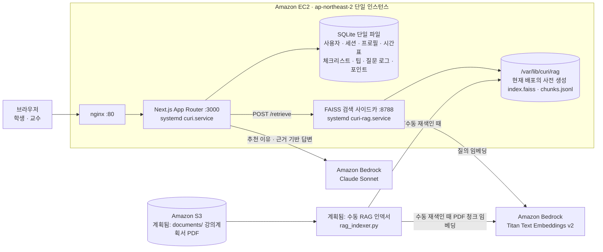

# CURI MVP 아키텍처

## 1. 시스템 경계



학생 동선은 회원가입·로그인 → 온보딩 → 추천 → 시간표 → 과목 상세 → 질문·팁이고, 교수 동선은 읽기 전용 리포트 하나다. 정제 JSON은 앱 번들에 포함된 로컬 파일을 읽으며, 배포 런타임에 S3 JSON loader는 없다. S3 문서 동기화와 재색인은 계획된 수동 절차로 아직 배포에 연결되지 않았다.

현재 배포의 Q&A는 EC2 로컬 인덱스와 Bedrock을 사용한다. S3 문서 원본 파이프라인은 계획된 별도 절차이며, 회원가입, 관리형 인증·DB, 알림, 외부 강의평, 자유서술 커뮤니티, 별도 관리형 벡터 DB는 경계 밖이다.

## 2. 라우트와 책임

```text
/                              로그인 학생 시간표 메인
/signup                        아이디·비밀번호 회원가입
/login                         아이디·비밀번호 로그인
/onboarding                    학생 프로필 7단계 입력
/recommend                     추천 결과와 시간표 담기
/profile                       프로필 수정 · 익명 준비왕 랭킹 · 능력 변화 대시보드
/courses/[courseId]            과목 상세; 대표 과목은 풀 상세
/professor                     교수 읽기 전용 리포트(익명 학급 현황·TMI 포함)
/api/signup                    계정 생성과 즉시 세션 발급
/api/session                   로그인·세션 조회·로그아웃
/api/profile                   프로필 저장·조회 + 온보딩 포인트
/api/recommend                 결정론적 필터 + Bedrock 이유
/api/courses                   시간표 담기·빼기
/api/checklist                 사용자별 체크 상태 + 항목·주간 완료 포인트
/api/qa                        검색·Bedrock·근거 없음 로그 + 질문 포인트
/api/tips                      팁 제출·집계 + 팁 포인트
/api/gamification              학생 포인트·레벨·뱃지 요약
/api/ranking                   익명 준비왕 랭킹(상위 5명 + 내 순위)
```

기존 `course-roadmap`, `weekly-coach`, `qa-panel`, `source-badge`, CURI 캐릭터, 디자인 토큰과 폰트는 과목 상세에서 재사용한다.

## 3. 핵심 타입

```ts
type UserRole = "student" | "professor";
type UserProfile = {
  userId: string;
  major: string | null;
  interest: string | null;
  goal: string | null;
  career: string | null;
  style: string | null;
  hours: string | null;
  avoid: string | null;
};
type CatalogCourse = {
  id: string;
  name: string;
  department: string;
  summary: string;
  goalKeywords: string[];
  difficulty: "입문" | "중급" | "심화";
  prerequisites: string[];
  interestTags: string[];
  schedule: { day: "월" | "화" | "수" | "목" | "금"; start: number; duration: number } | null;
  sourceKind: "actual" | "demo";
};
type Recommendation = { course: CatalogCourse; reason: string | null; score: number };
type QaResult = { status: "answered" | "not_found" | "model_error"; answer: string; citations: Citation[] };
```

## 4. 데이터 흐름

### 4.1 세션과 역할
1. `/signup`은 아이디·비밀번호·표시 이름을 허용 규칙으로 검증해 계정을 만들고, `/login`은 아이디로 조회한 자격증명을 scrypt 해시와 상수 시간 비교로 검증한다. 평문 비밀번호는 저장하지 않는다.
2. 서버는 암호학적으로 안전한 세션 ID를 생성해 `sessions`에 저장하고 HttpOnly·SameSite=Lax 쿠키로 발급한다.
3. 보호 라우트와 변경 API는 세션과 역할을 매 요청 확인한다.
4. 로그아웃은 세션 행을 삭제하고 쿠키를 만료한다.

### 4.2 온보딩과 추천
1. 학생이 7단계 단일 선택 값을 제출하면 서버가 허용 목록을 검증해 `user_profile`에 upsert한다.
2. 추천 필터는 비선호 태그를 제외하고 전공·관심·목표·시간 일치 점수를 계산한다.
3. 상위 후보 10~15개만 Bedrock에 전달하고 3~5개의 이유를 요청한다.
4. 모델 실패 시 결정론적 상위 결과를 이유 없이 반환한다.

### 4.3 시간표와 상세
1. 담기·빼기는 로그인 사용자와 과목 ID를 `user_courses`에 저장·삭제한다.
2. 메인은 카탈로그 프리셋으로 주간 그리드를 렌더한다.
3. 대표 과목은 기존 15주 JSON과 보충 데이터를 사용한다. 다른 과목은 카탈로그 요약만 표시한다.
4. 체크리스트는 `(user_id, course_id, item_id)`로 저장한다.

### 4.4 Q&A RAG
1. `/api/qa`는 질문과 선택한 `courseId`를 검증한다.
2. 현재 배포의 `curi-rag.service`는 `/var/lib/curi/rag/index.faiss`와 `/var/lib/curi/rag/chunks.jsonl`을 로컬에서 읽는다. `rag_sidecar.py`는 Bedrock Runtime 클라이언트만 만들며 S3 클라이언트를 만들거나 `CURI_DOCUMENT_BUCKET`을 읽지 않는다. 저장소만으로는 배포된 사전 생성 인덱스의 입력 경로를 확인할 수 없다.
   **계획됨(배포 미연결):** `scripts/rag_indexer.py`를 수동 실행하면 `CURI_DOCUMENT_BUCKET`의 `documents/` 아래 PDF와 `{pdf}.metadata.json`을 읽어 같은 로컬 파일을 재생성한다.
3. Q&A 런타임은 `CURI_RAG_RETRIEVER_URL`(기본 `http://127.0.0.1:8788/retrieve`)에 `{ courseId, question, numberOfResults: 5 }`를 POST한다.
4. retriever는 `metadata.courseId`가 요청 `courseId`와 정확히 같은 결과만 `{ results: [...] }`로 반환한다. 각 결과는 청크 텍스트, `s3Uri` 문자열, `courseId`, `courseName`, `department`, 선택적 숫자 `week`를 포함한다. 이 문자열을 반환하는 것만으로 S3 요청이 발생하지는 않는다.
5. 검색 결과가 없으면 Bedrock Runtime을 호출하지 않고 `not_found`를 반환하며 질문을 `qa_logs`에 저장한다.
6. 웹 앱은 검색 청크의 인용문과 `s3Uri`에서 파싱한 문서 파일명을 근거로 전달한다. 런타임 답변에는 검색된 근거만 인용하며, 이 과정에서 S3 원본을 다시 읽지 않는다.
7. retriever 또는 모델 오류는 `model_error`와 이미 확보된 근거를 유지한다.

### 4.5 수강생 팁
1. 세 척도·허용 태그·동의를 검증한다.
2. 로그인 사용자 ID로 삽입한다.
3. `(course_id, user_id)` 충돌은 HTTP 409다.
4. 삽입과 최신 집계 조회는 한 트랜잭션에서 수행한다.

## 5. SQLite 스키마

```sql
CREATE TABLE users (
  id TEXT PRIMARY KEY,
  name TEXT NOT NULL,
  role TEXT NOT NULL CHECK (role IN ('student','professor'))
);
CREATE TABLE sessions (
  id TEXT PRIMARY KEY,
  user_id TEXT NOT NULL REFERENCES users(id) ON DELETE CASCADE,
  expires_at TEXT NOT NULL
);
CREATE TABLE user_profile (
  user_id TEXT PRIMARY KEY REFERENCES users(id) ON DELETE CASCADE,
  major TEXT, interest TEXT, goal TEXT, career TEXT,
  style TEXT, hours TEXT, avoid TEXT,
  completed_at TEXT NOT NULL
);
CREATE TABLE user_courses (
  user_id TEXT NOT NULL REFERENCES users(id) ON DELETE CASCADE,
  course_id TEXT NOT NULL,
  PRIMARY KEY (user_id, course_id)
);
CREATE TABLE checklist_state (
  user_id TEXT NOT NULL REFERENCES users(id) ON DELETE CASCADE,
  course_id TEXT NOT NULL,
  item_id TEXT NOT NULL,
  completed INTEGER NOT NULL CHECK (completed IN (0,1)),
  PRIMARY KEY (user_id, course_id, item_id)
);
CREATE TABLE course_tips (
  id INTEGER PRIMARY KEY AUTOINCREMENT,
  course_id TEXT NOT NULL,
  user_id TEXT REFERENCES users(id) ON DELETE CASCADE,
  demo_key TEXT,
  prerequisite INTEGER NOT NULL CHECK (prerequisite BETWEEN 1 AND 3),
  practice INTEGER NOT NULL CHECK (practice BETWEEN 1 AND 3),
  workload INTEGER NOT NULL CHECK (workload BETWEEN 1 AND 3),
  tags_json TEXT NOT NULL,
  is_demo INTEGER NOT NULL DEFAULT 0 CHECK (is_demo IN (0,1)),
  created_at TEXT NOT NULL DEFAULT CURRENT_TIMESTAMP,
  UNIQUE(course_id, user_id),
  UNIQUE(course_id, demo_key)
);
CREATE TABLE qa_logs (
  id INTEGER PRIMARY KEY AUTOINCREMENT,
  course_id TEXT NOT NULL,
  question TEXT NOT NULL,
  created_at TEXT NOT NULL DEFAULT CURRENT_TIMESTAMP
);
CREATE TABLE credentials (
  user_id TEXT PRIMARY KEY REFERENCES users(id) ON DELETE CASCADE,
  username TEXT NOT NULL UNIQUE,
  password_hash TEXT NOT NULL,
  password_salt TEXT NOT NULL
);
CREATE TABLE point_events (
  user_id TEXT NOT NULL REFERENCES users(id) ON DELETE CASCADE,
  event_key TEXT NOT NULL,
  event_type TEXT NOT NULL,
  points INTEGER NOT NULL,
  awarded_at TEXT NOT NULL,
  PRIMARY KEY (user_id, event_key)
);
CREATE TABLE earned_badges (
  user_id TEXT NOT NULL REFERENCES users(id) ON DELETE CASCADE,
  badge_key TEXT NOT NULL,
  awarded_at TEXT NOT NULL,
  PRIMARY KEY (user_id, badge_key)
);
```

`point_events`는 append-only이며 `(user_id, event_key)` 기본키와 `INSERT OR IGNORE`로 중복 지급을 DB 레벨에서 막는다. 뱃지는 포인트 이벤트가 새로 삽입된 경우에만 부여한다.

데모 팁은 `user_id NULL`과 고정 `demo_key`를 사용한다. 사용자 팁만 사용자당 1회다. `qa_logs`는 교수 리포트에 학생 식별자를 노출하지 않는다.

## 6. 보안·오류 처리
- 모든 변경 API는 세션·역할·입력 허용 목록을 검증한다.
- 세션 쿠키는 HttpOnly·SameSite=Lax이며 운영 환경에서 Secure다.
- 로그인 실패 400, 미인증 401, 역할 위반 403, 중복 409, 저장 실패 500으로 구분한다.
- 추천 Bedrock 실패는 결정론적 후보를 유지한다. Q&A retriever·모델 실패는 이미 확보된 근거를 유지한 `model_error`다.
- 원본 PDF·zip·PEM·환경 파일은 Git·EC2 배포 산출물·공개 앱 S3 경로에 넣지 않는다.
- 현재 배포는 사전 생성된 로컬 인덱스를 읽으며, `CURI_DOCUMENT_BUCKET`이나 S3 문서 원본을 런타임에서 사용하지 않는다.
- **계획됨(배포 미연결):** PDF와 `{filename}.metadata.json`을 `CURI_DOCUMENT_BUCKET`의 비공개 `documents/` 접두사에 동기화한 뒤 `scripts/rag_indexer.py`를 별도로 실행해 로컬 FAISS 인덱스를 재구축한다. 정확한 명령은 [README](../README.md#rag-문서-색인-현황과-계획된-수동-재구축)에 둔다.
- `scripts/prepare-rag-documents.mjs`는 로컬 ZIP 경로에서 Git 밖 staging의 PDF와 `{filename}.metadata.json`을 생성한다. 이 명령은 업로드·인덱스 생성·배포 런타임에 참여하지 않는다.
- 강의정보에 개인정보가 있으면 앱 시작 전 데이터 검증에서 실패한다.

## 7. 검증 경계
- 단위: 카탈로그 검증, 추천 비선호 제외·점수, 팁 임계치, RAG 과목 필터.
- API: 세션 역할, 프로필, 추천 폴백, 시간표 지속성, Q&A 세 상태·로그, 팁 중복.
- 계획된 S3 RAG 준비: 77개 매핑의 고유성, staging 경계, PDF sidecar 메타데이터, `documents/` 동기화 dry run. 현재 배포 검증 항목은 아니다.
- EC2 RAG: Titan 임베딩 호출에 리전을 고정하지 않는지, 인덱스·청크 sidecar가 같은 버전인지, loopback retriever가 과목 ID가 다른 결과를 거부하는지 확인한다.
- 브라우저: 핵심 학생·교수 데모 동선을 데스크톱·모바일에서 마우스 없이 키보드만으로 통과한다. 음성 읽어주기(Web Speech)는 이번 범위에서 제외한다.
- 계획된 S3 절차를 배포하기 전에는 원본 zip·PDF·PEM·.env가 Git·EC2 배포 산출물에 없는지, 문서 버킷이 비공개인지 검사한다.
