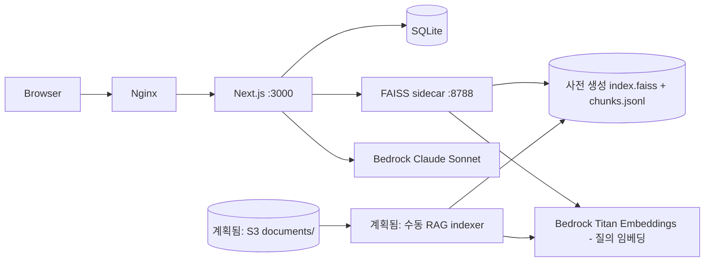

# CURI 전체 작업 기록 및 인수인계

> 기준 시점: 2026-09-02 · 브랜치 `feat/curi-mvp` · HEAD `5a10d68`
>
> 목적: 빈 폴더·아이디어 단계부터 현재 배포·발표 준비 상태까지의 경위, 구현, 결정, 검증, 남은 위험을 한 문서에 고정한다. 다음 에이전트는 이 문서를 먼저 읽고 현재 코드를 다시 검증한 뒤 작업한다.

## 1. 현재 상태 요약

CURI는 학생의 전공·관심·목표·학습 방식을 입력받아 과목과 추천 이유를 제시하고, 시간표·과목 상세·주간 준비·출처형 Q&A·학습 팁·게이미피케이션까지 연결하는 AI 수업 내비게이터다.

현재 구현은 다음 범위를 포함한다.

- 아이디·비밀번호 회원가입, 로그인, 로그아웃, 학생·교수 역할 분리
- 7단계 학생 온보딩과 프로필 수정
- 77개 과목 카탈로그 기반 결정론적 후보 선정과 Bedrock 추천 이유
- 주간 시간표, 과목 담기·빼기, 과목 상세, 대표 과목 15주 로드맵
- 이번 주 체크리스트와 사용자별 완료 상태
- 현재 배포: 사전 생성 EC2 로컬 FAISS → 출처형 Q&A. S3 PDF 동기화·재색인은 계획됨(현재 배포 미연결)
- 구조화 학습 팁과 교수용 근거 없음 질문 리포트
- 포인트·레벨·뱃지, 익명 학생 랭킹, 익명 학급 현황·TMI, 데모 능력 변화
- CURI 캐릭터·반응형 UI·상단바·모바일 시간표
- 데모 시드, 발표 대본, 발표자료 검토 문서

문서 작성 직전 HEAD는 `5a10d68 docs: add pitch deck review`였다. 현재 작업 트리에는 이 인수인계 문서와 README 링크 외에도 병행 작업이 만든 개인정보 마스킹, RAG 스크립트, 제품 문서 변경이 함께 미커밋 상태다. 다음 에이전트는 이를 사용자 작업으로 취급하고 reset/revert/clean하면 안 된다.

## 2. 처음부터 지금까지의 작업 순서

### 2.1 로컬 개발 환경 구성

최초 작업은 빈 폴더 `/Users/ahble/projects/hackthon/BTS`에서 시작했다. `local://paste-1.md`의 0→8 단계 가이드를 기준으로 순차 설정했다.

확인·설치한 항목:

- Node.js 24.19.0
- pnpm 11.25.0
- Git 2.55.0
- omp 18.0.11
- uv 0.11.28
- AWS CLI 2.36.35
- Docker CLI 29.7.2, Docker Compose 5.5.0
- Colima 0.10.3

Docker Desktop cask 설치는 macOS 관리자 비밀번호가 필요한 `/usr/bin/sudo` 단계에서 실패했다. 이를 억지로 우회하지 않고 Homebrew Docker CLI + Compose + Colima로 전환했다. 이 단계에서 CLI 설치는 끝났지만 초기 Colima VM 기동은 별도 점검이 필요했다.

AWS 프로필은 당시 없었고, Access Key를 만들지 않는 원칙을 유지했다. 프로젝트의 AWS 작업은 EC2 인스턴스 역할 또는 AWS 로그인 세션을 전제로 한다.

### 2.2 아이디어와 최초 MVP 범위 잠금

초기 제품은 단일 대표 과목 `웹컨텐츠개발`의 강의계획서 기반 수업 내비게이터였다.

초기 핵심:

1. 15주 로드맵
2. 이번 주 학습 코치
3. 출처형 Q&A
4. 구조화 학습 팁
5. 접근성

초기 문서 커밋:

- `377d1eb docs: lock CURI MVP scope`
- `8140894 docs: add CURI implementation plan`

이때는 로그인 없음, FAISS 미사용, 단일 과목 중심이었다.

### 2.3 모노레포 스캐폴드와 첫 기능

커밋:

- `ef0762b chore: scaffold CURI monorepo`
- `fe12967 chore: ignore TypeScript build cache`
- `7132908 feat: add course roadmap and weekly coach`

구조:

```text
apps/web        Next.js App Router + TypeScript
packages/db     better-sqlite3 기반 DB 패키지
infra           AWS CDK TypeScript 껍데기
scripts         시드·RAG 준비·배포 보조 스크립트
```

첫 구현은 대표 과목 로드맵과 7주차 코치였다.

### 2.4 팀 합의에 따른 제품 피벗

2026-09-01 17시 팀 합의로 제품이 다음 흐름으로 확장됐다.

```text
학생 이해 온보딩
  → 과목 추천 + 추천 이유
  → 시간표
  → 과목 상세
  → 주간 준비·Q&A·팁
  → 교수 익명 리포트
```

피벗 근거는 `docs/feature-triage-2026-09-01.md`, 실행 계획은 `docs/dev-plan.md`에 남아 있다.

초기 `docs/dev-plan.md`는 회원가입 없는 데모 계정만을 가정했지만, 이후 실제 아이디·비밀번호 인증과 회원가입으로 다시 변경됐다. 따라서 과거 문서 중 다음 문구는 현재 코드와 다르다.

- `IDEA.md`: 회원가입 제외
- `docs/prd.md`: 회원가입·비밀번호 제외, 데모 계정 선택 로그인
- `docs/demo-script.md`: 회원가입 없음, 데모 계정 선택
- `docs/decisions.md` D-5: 사전 생성 데모 계정만 사용

현재 실제 동작은 `README.md`, `docs/architecture.md`, 인증 코드가 더 정확하다. 후속 문서 정합 작업에서 위 네 문서를 최신 인증 흐름으로 고쳐야 한다.

### 2.5 데이터·인증·프로필·추천·시간표 구현

대규모 기능 커밋:

- `9b817c4 feat(db): add credential, session, and gamification storage`
- `666397c feat(web): add course catalog and shared app data`
- `0d41ec3 feat(web): add credential auth with signup and sessions`
- `1fd25d9 feat(web): add onboarding profile and recommendations`
- `04cbba0 feat(web): add timetable, course details, and weekly checklist`

인증의 현재 계약:

- username: 소문자·숫자·밑줄, 4~20자
- password: 10~72자
- name: trim 후 1~30자
- 회원가입 user ID: `randomUUID()`
- 비밀번호: scrypt hash와 salt만 SQLite에 저장
- 세션: 추측 불가능한 ID, HttpOnly·SameSite=Lax, 운영에서 Secure
- 잘못된 로그인: 401, 잘못된 입력: 400, 중복 username: 409
- 로그아웃: DB 세션 삭제 + 쿠키 만료

테스트 계정:

- `CURI_STUDENT_TEST_PASSWORD`가 설정되면 `student-test`
- `CURI_PROFESSOR_TEST_PASSWORD`가 설정되면 `professor-test`
- 값은 Git에 넣지 않고 `.env.local` 또는 서버 `EnvironmentFile`에 둔다.
- 빈 `createAppDatabase()`는 테스트 계정을 자동 생성하지 않는다.

추천 계약:

1. 비선호 제외
2. 전공·관심·목표·진로·학습스타일·시간을 결정론적으로 점수화
3. 후보 10~15개를 Bedrock Claude Sonnet에 전달
4. 후보 중 3~5개와 프로필 값에 근거한 한국어 이유를 받음
5. 모델 실패 또는 응답 구조 오류 시 결정론적 상위 5개 유지

`9ee4229 fix(web): restore Bedrock recommendation reasons`에서 추천 JSON이 800토큰에 잘리던 문제를 확인해 `maxTokens`를 2000으로 올렸고, 바깥쪽 ` ```json ` 코드 펜스를 방어적으로 제거했다.

### 2.6 RAG와 출처형 Q&A

커밋:

- `486ef99 feat(web): add grounded course Q&A with RAG sidecar`

현재 배포 구성:

```text
EC2 /var/lib/curi/rag/index.faiss + chunks.jsonl (사전 생성 파일)
  → loopback sidecar :8788 /retrieve
  → Next.js /api/qa
  → Bedrock Titan Text Embeddings v2 (질의 임베딩)
  → Bedrock Claude Sonnet 5
```

S3 `documents/` PDF → `scripts/rag_indexer.py` → 로컬 인덱스 재생성은 계획된 수동 절차다. 현재 배포는 S3나 `CURI_DOCUMENT_BUCKET`을 읽지 않으며, 저장소에는 사전 생성 인덱스의 입력 경로가 기록되어 있지 않다.

핵심 안전 규칙:

- 요청 `courseId`와 같은 청크만 반환
- 검색 결과 없음: 모델 호출 없이 `not_found`
- 근거 있음: 근거만 모델에 전달
- 모델 실패: `model_error`, 이미 찾은 citation 유지
- 수강생 팁은 공식 Q&A 근거로 사용하지 않음
- 원본 ZIP은 업로드하지 않음
- 교수 연락처·이메일·면담·민원 정보는 공개 데이터와 색인에서 제외

주의: 초기 문서는 FAISS 금지를 기록하지만, 현재 배포는 EC2 로컬 FAISS를 사용한다. 저장소만으로는 이 선택의 AWS 권한 근거나 배포 인덱스의 입력 경로를 확인할 수 없다. 현재 기준은 `docs/decisions.md` D-6 개정과 `docs/architecture.md`다.

### 2.7 팁·교수 리포트·게이미피케이션

커밋:

- `c1aac30 feat(web): add structured course tips`
- `20bb171 feat(web): add professor report`
- `bedaf09 feat(web): add gamification points, levels, and badges`

팁:

- 세 척도 1~3
- 허용 태그 1개 이상
- 동의 필수
- 자유서술 없음
- `UNIQUE(course_id, user_id)`로 계정당 과목 1회
- 5건 미만 집계 비공개

포인트:

| 이벤트 | 점수 | 중복 방지 |
| --- | ---: | --- |
| 온보딩 완료 | 30 | 사용자당 1회 |
| 체크리스트 항목 완료 | 10 | 과목·항목당 평생 1회 |
| 유효 Q&A 종료 상태 | 5 | 정규화 질문 SHA-256, UTC 하루 고유 3개까지 |
| 학습 팁 제출 | 20 | 과목당 1회 |
| 주간 체크리스트 전체 완료 | 30 | 과목·주차당 1회 |

레벨:

- Lv1: 0~49
- Lv2: 50~99
- Lv3: 100+

뱃지:

- `나를 아는 학생`
- `호기심 탐험가`
- `길잡이`
- `이번 주 정복`

DB는 append-only `point_events`와 `earned_badges`를 사용한다. `(user_id, event_key)` 기본키와 트랜잭션이 재체크·재제출 포인트 농사를 막는다. Q&A event key에는 질문 원문이 아니라 날짜와 SHA-256만 저장한다.

UI는 `curi:gamification` CustomEvent로 상단바 점수·레벨·신규 뱃지 알림을 즉시 갱신한다.

### 2.8 브랜딩·P3 데모 기능

커밋:

- `f4c86fe feat(web): add CURI branding, mascot, and home experience`
- `f41e1bf feat(db): add anonymous class and ranking reports`
- `b4f32ec feat(web): add anonymous student ranking`
- `d00a75d feat(web): add anonymous professor class insights`
- `6849998 feat(web): add demo ability dashboard`

추가된 기능:

- CURI 캐릭터 11종과 보상 상태
- 학생 상단바 점수·레벨·뱃지
- 익명 준비왕 상위 5명과 내 순위
- 교수용 익명 학급 현황
- 프로필 5명 이상일 때만 공개되는 학급 TMI
- 명시적으로 `데모 데이터`로 표시하는 능력 변화 시뮬레이션

익명성:

- 랭킹 이름은 첫 글자 + `**`
- 교수 집계에 user ID나 학생 이름 없음
- 프로필 분포는 5명 미만이면 비공개

### 2.9 데모 시드·배포 문서·발표 준비

커밋:

- `dad193e feat(web): add idempotent demo seed command`
- `59aa32d docs: add pitch script and sync architecture with shipped routes`
- `b5e307e docs: add judge walkthrough and AWS service list`
- `5a10d68 docs: add pitch deck review`

`pnpm seed`는 다음을 멱등하게 준비한다.

- 대표 과목 데모 팁
- 교수 리포트용 근거 없음 질문 3개

발표 문서:

- `docs/pitch.md`: 60초·3분 발표 대본, 예상 질문 대응
- `docs/pitch-deck-review.md`: 13장 발표자료의 치명·높음·보통 문제
- `docs/pitch-script-revisions.md`: 슬라이드 문구 수정 재료

발표자료 검토의 가장 큰 미완료:

1. 빈 아키텍처 슬라이드 2장 중 하나 삭제, 하나 완성
2. 스톡 이미지와 제작 메모를 실제 서비스 캡처로 교체
3. `AI 커리큘럼 안내 챗봇`을 `학생을 이해하는 AI 수업 내비게이터`로 통일
4. 구현되지 않은 알림 기능 제거
5. 팀 소개·페이지 순서·번호 정리

## 3. 현재 시스템 구조

### 3.1 런타임



### 3.2 주요 라우트

| 라우트 | 책임 |
| --- | --- |
| `/signup` | 학생 계정 생성 |
| `/login` | 학생·교수 credential 로그인 |
| `/onboarding` | 7단계 프로필 입력 |
| `/recommend` | 개인화 과목 추천 |
| `/` | 학생 시간표 메인 |
| `/profile` | 프로필 수정·익명 랭킹·능력 변화 |
| `/courses/[courseId]` | 과목 상세·Q&A·체크리스트·팁 |
| `/professor` | 익명 교수 리포트 |
| `/api/gamification` | 학생 포인트·레벨·뱃지 조회 |
| `/api/ranking` | 익명 학생 랭킹 |

### 3.3 데이터베이스

주요 테이블:

- `users`
- `credentials`
- `sessions`
- `user_profile`
- `user_courses`
- `checklist_state`
- `course_tips`
- `qa_logs`
- `point_events`
- `earned_badges`

스키마 기준 파일은 `packages/db/src/schema.ts`, 구현은 `packages/db/src/database.ts`, 익명 리포트 쿼리는 `packages/db/src/reports.ts`다.

## 4. AWS와 배포 상태

README와 발표 문서는 배포 URL을 `http://13.209.117.175`로 기록한다.

사용 서비스:

- EC2: nginx, Next.js, 사전 생성 로컬 인덱스를 읽는 FAISS sidecar
- S3: **계획됨(현재 배포 미연결)** — PDF·sidecar metadata 동기화와 수동 재색인용
- Bedrock Claude Sonnet: 추천 이유·Q&A 답변
- Bedrock Titan Text Embeddings v2: Q&A 질의 임베딩, 계획된 수동 재색인 시 PDF 청크 임베딩

CDK의 `infra/lib/infra-stack.ts`는 현재 빈 Stack이다. 즉 실제 배포는 CDK가 아니라 기존 EC2에 릴리스 디렉터리를 올리고 `current` 심링크와 systemd를 전환하는 운영 절차다.

배포 절차는 README에 기록되어 있다. 단, 다음 작업은 사용자 승인 없이 하면 안 된다.

- deploy/destroy
- EC2 종료·재시작
- systemd 서비스 재시작
- S3 동기화 실행

Access Key를 발급하거나 저장하지 않는다. EC2 인스턴스 역할을 사용한다.

## 5. 현재 테스트·검증 상태

이 문서 작성 후 현재 HEAD와 문서 변경 상태에서 전체 검증을 다시 실행했다.

- `pnpm typecheck`: 통과
- `pnpm test`: Web 136/136 통과. `packages/db`·`infra`에는 자체 테스트 파일이 없어 각각 `node --test`가 pass 0·fail 0으로 종료된다. DB 동작은 Web 테스트 39개 중 `@curi/db`를 직접 사용하는 14개 파일에서 간접 검증한다.
- `pnpm lint`: 오류 0, 경고 4
- `pnpm build`: 통과, Next.js route 표 20개. 빌드 중 표시되는 `Generating static pages (17/17)`은 route 총수가 아니라 정적 페이지 생성 작업 수다.

lint 경고는 `recommendations-panel.tsx`의 `` 1건과 `timetable.tsx`·`weekly-coach.tsx`의 내부 이동 `window.location.assign()` 3건이다. 테스트 출력의 `CURI_RECOMMENDATION_MODEL_ERROR` 3건은 추천 폴백을 검증하는 의도된 진단 로그이며 테스트 실패가 아니다.

재검증 명령:

```bash
pnpm typecheck
pnpm test
pnpm lint
pnpm build
```

RAG 런타임:

```bash
python3 scripts/test_rag_runtime.py
```

브라우저 검증:

1. `/signup` 회원가입
2. 온보딩 완료 후 30P와 뱃지 표시. 현재 30P·레벨 표시는 통과하지만, 서버가 지급한 뱃지를 화면에 렌더하지 않는 결함이 있어 P0 수정이 필요하다.
3. 추천 이유 표시
4. 시간표 담기·새로고침 유지
5. 체크리스트 포인트와 중복 방지
6. 근거 있는 Q&A, 근거 없는 Q&A
7. 팁 제출과 409 중복
8. 프로필 랭킹·데모 능력 변화
9. 교수 리포트 익명 집계
10. 로그아웃과 교수 계정 전환

## 6. 문서 간 불일치와 위험

### 6.1 인증 문서가 과거 상태

`IDEA.md`, `docs/prd.md`, `docs/demo-script.md`, `docs/decisions.md`는 회원가입 없는 데모 계정 선택 로그인을 여전히 기술한다. 현재 코드는 credential 회원가입·로그인이다. README와 architecture가 최신이다.

### 6.2 FAISS 결정의 역사

초기에는 FAISS 금지였다. 현재 소스와 배포 구성은 EC2 로컬 FAISS를 사용한다. 저장소는 Bedrock Knowledge Base·S3 Vectors 권한이나 배포 인덱스의 입력 경로를 증명하지 않으므로, S3 재색인을 현재 동작으로 주장하면 안 된다. 최신 기준은 D-6 개정과 architecture다.

### 6.3 CDK와 실제 배포의 차이

CDK stack은 비어 있다. README의 배포 URL과 운영 절차는 기존 수동 EC2 배포를 가리킨다. `cdk deploy`로 재현 가능한 인프라라고 주장하면 안 된다.

### 6.4 배포 URL은 변동 정보

2026-09-02 읽기·데모 동작 smoke 결과:

- `http://13.209.117.175` 응답 200.
- `student-test` 로그인 200, 비밀번호 주입 정상. 다만 현재 프로필이 없어 `/onboarding`으로 이동하며 추천 API는 400을 반환한다.
- smoke 전용 학생 `smk041115`을 생성해 프로필 저장(200) → 추천(200) → Q&A(200)를 확인했다. 추천은 4건 모두 이유가 채워졌고 최상위 `reasonStatus: "ok"`였다.
- Q&A는 `status: "answered"`, 인용 5건으로 Bedrock 답변과 FAISS sidecar 검색이 모두 동작했다.
- **중요:** 라이브 Q&A 인용문에 교수 전화번호와 이메일이 그대로 노출됐다. 로컬 작업 트리의 `/api/qa` 개인정보 마스킹 변경이 라이브에 아직 배포되지 않았다는 증거다.
- `professor-test` 로그인과 `/professor` 렌더는 200. 페이지 본문에서 이메일·휴대전화 패턴은 검출되지 않았고 익명 안내를 확인했다.

따라서 공개 URL·데모 계정·Bedrock 추천·Bedrock Q&A·FAISS sidecar는 동작하지만, 최신 로컬 변경 전체가 반영된 배포는 아니다. smoke 과정에서 생성한 `smk041115` 계정은 라이브 DB에 남아 있다.

### 6.5 발표자료 미완료

`docs/pitch-deck-review.md`의 치명 항목이 실제 슬라이드에서 수정됐는지 확인되지 않았다.

### 6.6 실제 브라우저 E2E

로컬 프로덕션 서버에서는 Chrome for Testing을 CDP로 직접 제어해 10단계 동선과 키보드 전용 3패스를 실행했고 13/13 통과했다. 증거는 `~/projects/hackthon/.omo/evidence/20260902-c5-browser-qa/`에 있다.

라이브 EC2에서는 위 6.4의 API·HTML smoke를 실행했지만, 동일한 전체 브라우저 동선은 다시 실행하지 않았다. 이 워크스테이션의 Chrome for Testing은 평문 HTTP 생 IP 이동을 `net::ERR_BLOCKED_BY_CLIENT`로 차단하므로, 발표 전 실제 사용자 브라우저 또는 도메인/HTTPS 환경에서 확인한다.

### 6.7 병행 미커밋 변경

최종 체크포인트 생성 시점에 20개 경로가 modified/untracked였다. 확인된 신규 코드는 `apps/web/lib/redact.ts`와 `apps/web/tests/redact.test.ts`이며, `/api/qa` 답변·citation의 이메일·전화번호를 마스킹한다. `pnpm test`의 개인정보 마스킹 테스트와 Q&A API 마스킹 테스트는 통과했다. 그 밖에 `.env.example`, 제품 문서, RAG 준비·업로드 스크립트도 변경 중이다. 이 변경들은 본 문서화 작업이 만든 것이 아니므로 다음 에이전트는 diff와 소유권을 확인한 뒤 통합해야 한다.

## 7. 실패·우회·운영상 배운 점

- Docker Desktop 설치는 관리자 비밀번호 때문에 실패했고 Colima로 전환했다.
- Codex background 작업은 네트워크 reconnect 실패 후 프로세스만 남은 적이 있다. 작업 ID는 프로세스 로컬일 수 있으므로 파일 변경과 실제 프로세스를 함께 확인해야 한다.
- 장시간 Claude 구현 에이전트도 사용자 요청으로 중단됐다. 에이전트 보고가 아니라 부모 세션 테스트로 결과를 검증해야 한다.
- 한때 인증 제거 후 테스트 fixture 사용자를 명시 생성하지 않아 SQLite FK 실패 18건이 발생했다. 현재는 `apps/web/tests/helpers/auth.ts`가 fixture credential user를 명시 생성한다.
- 추천 이유는 maxTokens 800에서 JSON이 잘렸다. 현재 2000이다.
- 테스트 출력의 `CURI_RECOMMENDATION_MODEL_ERROR`는 폴백 테스트가 의도적으로 발생시키는 로그일 수 있다. exit code와 fail count로 판정한다.

## 8. 다음 에이전트의 시작 순서

1. 이 문서를 읽는다.
2. `git status --short`와 `git log -5 --oneline`을 확인한다.
3. `README.md`, `docs/architecture.md`, `docs/pitch-deck-review.md`를 읽는다.
4. 현재 HEAD에서 `pnpm typecheck && pnpm test && pnpm lint && pnpm build`를 실행한다.
5. 실패가 있으면 재현 테스트부터 고친다.
6. 라이브 URL과 데모 계정을 smoke test한다. 배포 변경은 하지 않는다.
7. 가장 먼저 문서 정합성을 고친다. 특히 인증 흐름이 구버전인 4개 문서.
8. 발표자료 치명 항목을 수정하고 실제 화면 캡처를 반영한다.
9. 모든 로컬·브라우저 검증이 끝난 뒤에만 사용자 승인으로 배포한다.

## 9. 즉시 작업 우선순위

### P0 발표 전 필수

- 현재 HEAD 전체 테스트·typecheck·lint·build 재검증
- 배포 URL 가용성·최신 코드·Bedrock·RAG sidecar 실검증
- 로컬 Q&A 개인정보 마스킹 변경을 검증·배포하고, 라이브 인용문에서 전화번호·이메일이 제거되는지 재확인
- 회원가입→학생 흐름→교수 전환 라이브 smoke
- 온보딩에서 지급된 뱃지를 상단 계정 영역 또는 프로필에 보이도록 렌더하고 실브라우저로 확인
- 발표 슬라이드 빈 아키텍처·메모·스톡 이미지·구버전 포지셔닝 수정
- test 계정 비밀번호가 화면·Git·문서에 노출되지 않는지 확인

### P1 문서 정합

- `IDEA.md`의 회원가입 제외 문구 수정
- `docs/prd.md` FR-10을 credential 인증으로 수정
- `docs/demo-script.md`를 현재 10단계 시연과 포인트/P3 기능으로 수정
- `docs/decisions.md` D-5를 실제 인증 결정으로 수정
- dev-plan의 구버전 문구에 superseded 표시

### P2 유지보수

- CDK를 실제 배포 구조로 구현할지, 수동 EC2 배포만 공식화할지 결정
- lint 경고 정리
- 라이브 배포 재현 절차와 rollback 증거 보강

## 10. 절대 하지 말 것

- 사용자 승인 없이 deploy/destroy/EC2 재시작/S3 동기화
- AWS Access Key 생성·사용
- `.env.local`, test 계정 비밀번호, 세션, PEM 커밋
- 원본 ZIP·PDF 개인정보를 앱 데이터나 공개 저장소에 추가
- Q&A 근거에 수강생 팁 사용
- 근거 없는 질문에 모델 답변 생성
- 실패한 과거 에이전트 결과를 검증 없이 신뢰

## 11. 중요 파일 지도

| 영역 | 파일 |
| --- | --- |
| 현재 사용법·배포 | `README.md` |
| 전체 구조 | `docs/architecture.md` |
| 과거 제품 결정 | `docs/decisions.md`, `docs/feature-triage-2026-09-01.md` |
| 발표 | `docs/pitch.md`, `docs/pitch-deck-review.md` |
| DB | `packages/db/src/schema.ts`, `database.ts`, `reports.ts` |
| 인증 | `apps/web/lib/auth.ts`, `app-db.ts`, `/api/signup`, `/api/session` |
| 추천 | `apps/web/lib/recommendations.ts`, `recommend-bedrock.ts`, `/api/recommend` |
| RAG | `apps/web/lib/knowledge-base.ts`, `bedrock.ts`, `/api/qa`, `scripts/rag_*` |
| 게임화 | `apps/web/lib/gamification.ts`, `packages/db/src/database.ts`, `/api/gamification` |
| 익명 보고 | `packages/db/src/reports.ts`, `student-ranking.tsx`, `professor-report.tsx` |
| 테스트 | `apps/web/tests/` |

## 12. 커밋 연대기

| 커밋 | 내용 |
| --- | --- |
| `377d1eb` | 최초 MVP 범위 잠금 |
| `8140894` | 구현 계획 |
| `ef0762b` | 모노레포 스캐폴드 |
| `7132908` | 로드맵·주간 코치 |
| `b056c27` | 피벗·인증·게임화 문서 개정 |
| `9b817c4` | credential/session/gamification DB |
| `666397c` | 과목 카탈로그 |
| `0d41ec3` | 회원가입·로그인·세션 |
| `1fd25d9` | 온보딩·추천 |
| `04cbba0` | 시간표·상세·체크리스트 |
| `486ef99` | RAG Q&A |
| `c1aac30` | 구조화 팁 |
| `20bb171` | 교수 리포트 |
| `bedaf09` | 포인트·레벨·뱃지 |
| `f4c86fe` | 브랜딩·마스코트·홈 |
| `f41e1bf` | 익명 리포트 DB |
| `b4f32ec` | 학생 랭킹 |
| `d00a75d` | 교수 익명 학급 현황 |
| `6849998` | 데모 능력 변화 |
| `dad193e` | 멱등 데모 시드 |
| `59aa32d` | 발표 대본·아키텍처 동기화 |
| `b5e307e` | 심사위원 안내·AWS 목록 |
| `9ee4229` | Bedrock 추천 이유 복구 |
| `5a10d68` | 발표자료 리뷰 |

---

이 문서는 인수인계의 단일 시작점이다. 제품 요구사항의 일부 과거 문서가 현재 코드와 충돌하므로, 사실 확인 우선순위는 **현재 코드와 테스트 → README/architecture → 이 문서 → 과거 PRD/dev-plan** 순서로 둔다.
